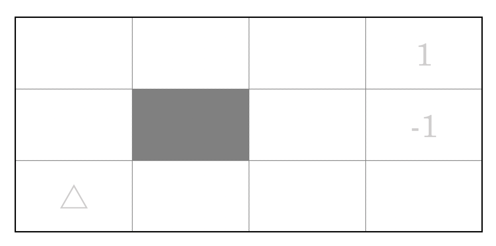

# Reinforcement learning gridworld

Suppose that an agent is situated in the 4×3 environment shown in the figure below. Beginning
in the start state, it must choose an action at each time step. The interaction with the environment
terminates when the agent reaches one of the goal states, marked +1 or –1. Aavailable actions are Up, Down, Left, and Right. We assume, this gridworld is deterministic, meaning  the agent will go where it intends to go. For example, when the agent decides to take action up at (0, 1), it will land in (0, 2) rather than elsewhere. 

We apply reinforcement learning to find best traveling path for the agent. 

<
